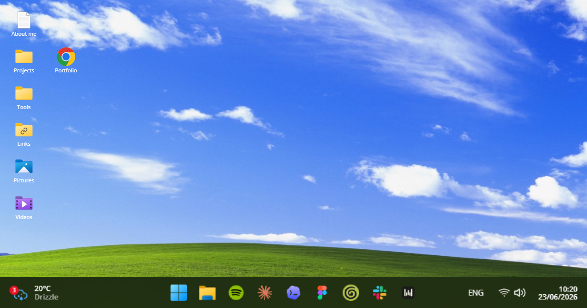

# Pedro Loula — Portfolio

My personal portfolio: a small desktop-shaped world for exploring my work in product design, systems, and AI.

It brings together selected projects, experiments, and a little more about how I think and work. Visit it at [pedroloula.com](https://www.pedroloula.com).



## Inside

- Selected product and design-system work
- Case studies for Portoro, Agentic Design System, Trashie, Plug, and Froggo's
- An interactive Windows-inspired interface, with desktop apps, folders, and a terminal

## Built with

Next.js, React, TypeScript, Framer Motion, GSAP, and a slightly unreasonable fondness for old-school desktop interfaces.

## Run it locally

```bash
npm install
npm run dev
```

Then open [http://localhost:3000](http://localhost:3000).

## Credit

This portfolio is a personal adaptation of the **Windows11-portfolio** concept, inspired by [kassq](https://github.com/KasperiP/windows11-portfolio). The content, projects, visual direction, and custom interactions are my own.

